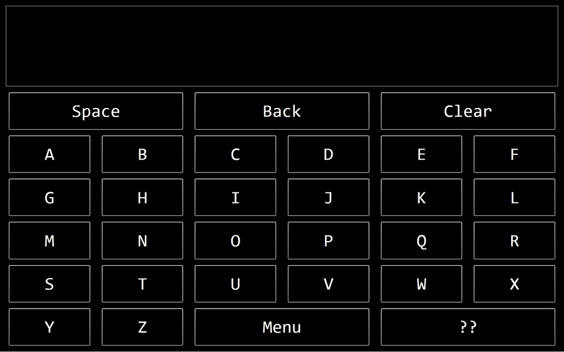

# KiepSimpleTalk
### A C# WPF application for single button communication, using scanning pattern
 
Fullscreen, high contrast, slow scanning. For people with disabilities, limiting them to 1 button input.

Download [here](https://github.com/Joozt/KiepSimpleTalk/releases)

Features:
- Start scanning, select row and character with `space`
- Exit with `escape`

